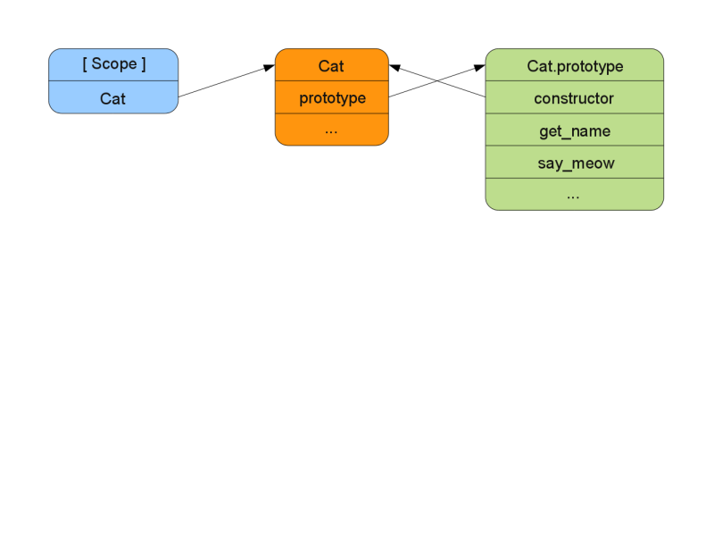
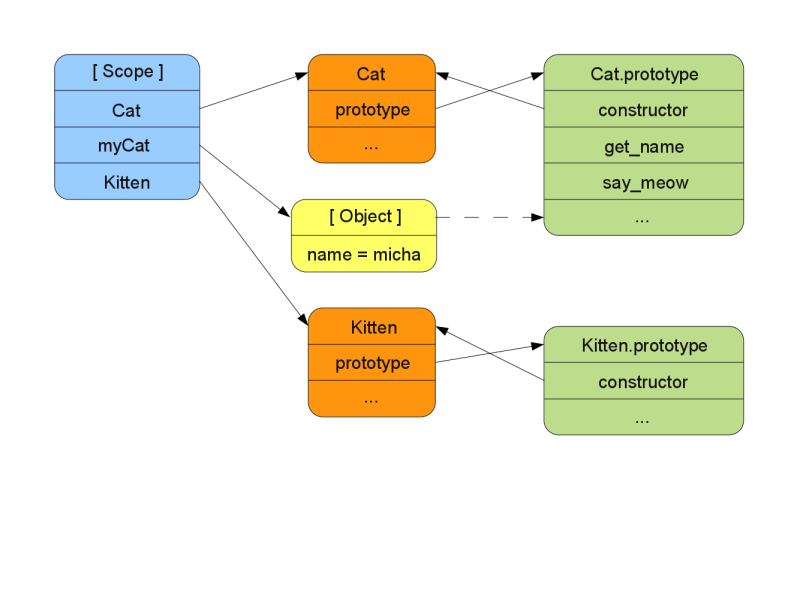
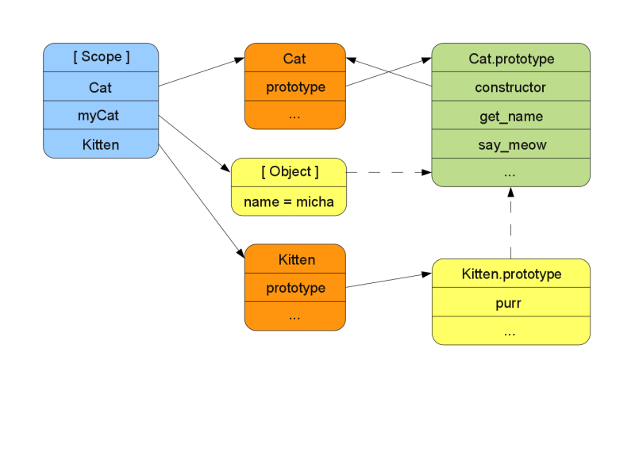

!SLIDE execute transition=scrollUp
# Constructors #

    @@@ javaScript
    var Cat = function(name) {
        this.name = name;
    };

    var myCat = new Cat("micha");
    CORE.out( myCat.name );

!SLIDE execute transition=scrollUp
# Constructor prototype #

    @@@ javaScript
    var Cat = function(name) {
        this.name = name;
    };
    Cat.prototype.get_name = function() {
        CORE.out( this.name );
    };
    Cat.prototype.say_meow = function() {
        CORE.out( 'meow' );
    };

    var myCat = new Cat("micha");
    myCat.get_name();
    myCat.say_meow();

!SLIDE center transition=scrollUp

!SLIDE center transition=fade

!SLIDE center transition=fade

!SLIDE center transition=fade

!SLIDE execute transition=scrollUp
# Pseudoclassical inheritance #

    @@@ javaScript
    var Cat = function(name) { this.name = name; };
    Cat.prototype.say_meow = function() {
        CORE.out('meow');
    };

    var Kitten = function(name) {
        this.name = name;
    };
    Kitten.prototype = new Cat();
    Kitten.prototype.purr = function() {
        CORE.out('r-r-r-r-r');
    };
    var myKitten = new Kitten("catrin");
    CORE.out(myKitten.name);
    myKitten.say_meow();
    myKitten.purr();

!SLIDE center transition=scrollUp

!SLIDE center transition=fade

!SLIDE center transition=fade

!SLIDE bullets incremental transition=scrollUp
# Problems #

* No encapsulation
* Weird syntax
* Duplication of code (constructors)

